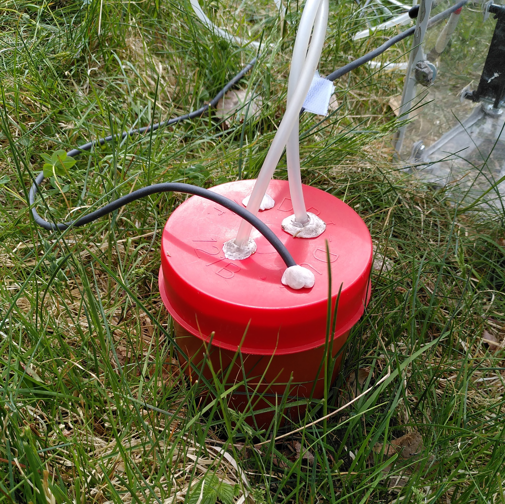
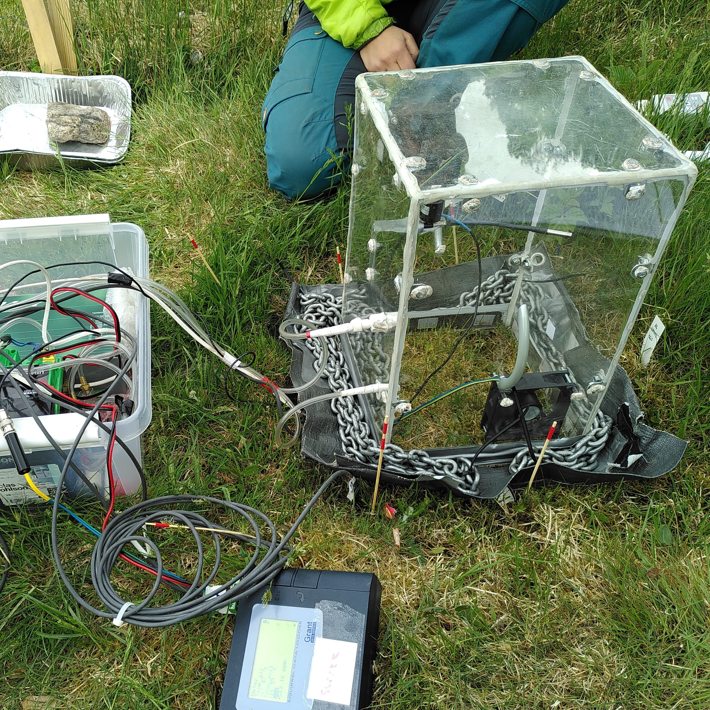
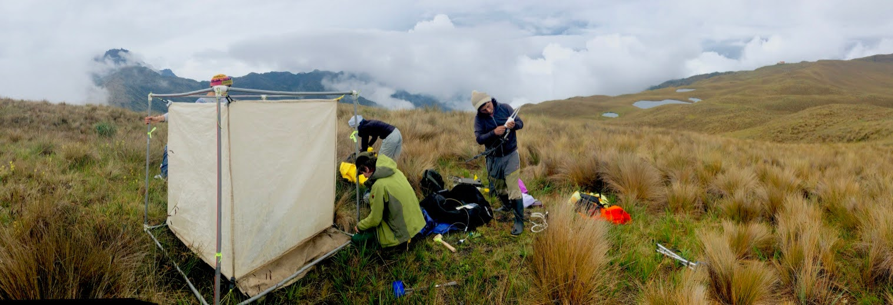

<!-- 3566 words without data av and abstract -->
<!-- 3811 words total -->
<!-- word limit including references 3000-4000 -->


```{r}
#| label: setup
#| include: false

library(googlesheets4)
library(plume)
knitr::opts_chunk$set(
  collapse = TRUE,
  comment = "#>"
)
options(tidyverse.quiet = TRUE)

tbl_authors <- read_sheet(gs4_find("authors_fluxible"))

aut <- Plume$new(tbl_authors)
aut$set_corresponding_authors(1)
```

<!-- `r aut$get_author_list("^a,^co")` -->

```{r}
#| results: asis
#| eval: false
aut$get_affiliations() |> cat(sep = "\n\n")
```

<!-- \*Correspondence to: `r aut$get_contact_details()` -->

# Abstract {.unnumbered}

<!-- 171 words -->

## 1 {.unnumbered}

Measuring ecosystem gas fluxes is crucial to understanding the dynamics of ecosystem water and energy cycling.
A common method to measure ecosystem gas fluxes (CO~2~, CH~4~, N~2~O) and to compare experimental treatments is the use of closed-loop chambers.

## 2 {.unnumbered}

However, the output data require extensive processing before analysis, making the workflow prone to bias and limiting comparability between studies.
While there are various methods to process flux data, they lack reproducibility and automation.

## 3 {.unnumbered}

The `fluxible` R package provides a reproducible way to process raw gas concentration data from closed-loop chambers into an analysis-ready dataset of ecosystem gas fluxes.
The processing steps include (1) separating the measurements, (2) fitting a linear, quadratic, or exponential model, (3) assessing the quality of the fit, (4) plotting the fluxes for visual inspection, and (5) calculating the fluxes.

## 4 {.unnumbered}

In addition to reproducibility, `fluxible` focuses on homogeneity and automation in data processing, thus reducing the time investment for users while improving comparability across studies.

**Keywords**: ecosystem gas fluxes, flux chambers, greenhouse gas emissions, R package, reproducible workflow

# Data availability {.unnumbered}

<!-- 74 words -->

The data used in the validation (Section 3) and those used in the data preparation example (Appendix B) can be downloaded from Open Science Framework: [osf.io/srj24](https://osf.io/srj24/).
The data for the detailed example (Appendix A) and the workflow with two gases (Appendix C) are part of `fluxible`.
The code of the package is available on GitHub: [github.com/Plant-Functional-Trait-Course/fluxible](https://github.com/Plant-Functional-Trait-Course/fluxible).
The code for the validation section and figures production is available on GitHub: [github.com/jogaudard/fluxible-MEE](https://github.com/jogaudard/fluxible-MEE).

# Introduction

<!-- 626 words -->


Measuring ecosystem gas fluxes (hereafter fluxes) quantifies how resources are allocated in ecosystems and provides crucial information to predict future global warming [@bastvikenCriticalMethodNeeds2022].
At the plot scale, fluxes are commonly measured using closed-loop chamber systems (@fig-chambers; hereafter chambers), allowing comparison across environmental gradients and experimental treatments [@maesEnvironmentalDriversIncreased2024; @arnoneLargeDaylightGeodesic2003].
The flux calculation (i.e., the amount of gas per time per area) is based on the rate of change of gas concentration inside the chamber.
This rate is the derivative of a function $C(t)$ describing the gas concentration over time.
However, various methods are used to approximate $C(t)$, and the choice of method can introduce biases and - if not explicitly described - increase the likelihood of misinterpretations between processed fluxes [@johannessonOptimizingClosurePeriod2024;  @pihlatieComparisonStaticChambers2013; @forbrichComparisonLinearExponential2010].

The way forward is to provide fully reproducible and transparent tools to calculate ecosystem gas fluxes.
Such tools and workflows also need to be flexible enough to be compatible across various field setups and gases.
This is what the `fluxible` R package, presented in this paper, aims for.

The process of obtaining an analysis-ready flux dataset entails several crucial steps.
First, the raw field measurements are trimmed of irrelevant sections in the case of continuous logging, or gathered if they were recorded separately, and attributed to metadata.
Second, an appropriate model is fit to the data and fit quality is assessed.
Third, the fluxes are calculated from the model output.
This step must accommodate different field setups (@fig-chambers), such as adjusting the volume input for a fixed or variable chamber volume.
Indeed, the chamber volume often varies due to microtopography, and this variation should be accounted for in flux calculations.


::: {#fig-chambers layout-nrow=2}
{#fig-soil fig-align="left" width=98%}

{#fig-threed fig-align="right" width=98%}


{#fig-tent fig-align="center" width=200%}

Field-based ecosystem gas flux measurements. [-@fig-soil]) soil respiration is measured using a PVC pipe chamber. [-@fig-threed]) closed-loop plexiglass chamber to measure ecosystem carbon and water fluxes. The chamber has sensors to measure different environmental data, which should be processed simultaneously with the fluxes. [-@fig-tent]) Flux tent used for measurements in ecosystems with taller vegetation.
:::

There are two main pathways to determine $C(t)$.
The theoretical approach taken by @kutzbachCO2FluxDetermination2007 includes the relevant flux processes (e. g. photosynthesis, plant respiration, soil respiration) in one equation.
An alternative approach is to empirically find a mathematical expression that adequately describes the shape of the fluxes.
The latter approach has the advantage of being easier to implement and optimize when fitting a model to real data.
The most common is the Hutchinson-Mosier model [HM\; @hutchinsonImprovedSoilCover1981].
As the HM model cannot fit linear data, implementing it relies on the user deciding if a flux should be fitted with a linear or the HM model [`HMR` R package\; @HMRpackage].
An improvement was the kappamax method [@huppiRestrictingNonlinearityParameter2018], which automates this step, making the workflow reproducible.
As different models tend to under- or overestimate fluxes [@johannessonOptimizingClosurePeriod2024; @pihlatieComparisonStaticChambers2013; @forbrichComparisonLinearExponential2010], using an exponential and a linear model within the same dataset hinders the comparability of the data.
Removing the need to choose between the linear or the HM model, @zhaoCalculationDaytimeCO22018 introduced a model that can fit both linear and exponential fluxes and takes into account the potential uncertainty around the real start of the measurement.


Here, we introduce the `fluxible` package, using R language [@rcoreteamLanguageEnvironmentStatistical2024].
The package takes raw gas concentration data to an analysis-ready clean dataset of fluxes in five functions (@fig-concept).
The core principles of `fluxible` are to (1) treat the entire dataset homogeneously, (2) allow full model choice and quality thresholds flexibility, and (3) be transparent and reproducible.

# Implementation

<!-- 1272 words -->


`fluxible` provides a user-friendly and fully transparent workflow to calculate fluxes measured with chambers (@fig-concept), in which the user decides *a priori* on model type and quality control.
The R package can be installed from CRAN (“The Comprehensive R Archive Network”, n.d.) using `install.packages("fluxible")`, and an example workflow is available in Appendix A.

{#fig-concept}


## Input and output

`fluxible` requires two inputs: a dataset of the gas concentration over time and a separate metadata file recording  the start time of each measurement (@fig-concept).
The gas concentration dataset is produced by a logger or a gas analyser and contains at minimum a datetime column and a gas concentration column for all the measurements (i. e. a time serie of gas concentration that will result in a single flux).
The second file must contain a column with the start of each measurement (in datetime format) and identifiers (e.g. the plot IDs) for each measurement.
Both inputs can contain other columns, which will be kept.
Appendix B provides guidelines for importing the data, both for the continuous logging and "one file per flux" approaches.
As the data processing and quality control is done for the entire dataset, we recommend carefully considering what constitutes one dataset (e.g., splitting different campaigns in separate datasets) before starting the `fluxible` workflow.
When measuring different gases simultaneously, we also recommend making a separate dataset for each gas, as the quality checks require different thresholds (see Appendix C for a multi-gas example).

The final output of the `fluxible` workflow is a dataset containing: clean fluxes (@fig-concept), timestamps of the start of the measurements, measurement identifiers provided in the measurements record, and any other variables present in either input.

## Attributing meta-data

The `flux_match` function matches each flux, i.e., a series of gas concentration data points over time, with their measurement metadata based on the time stamp (@fig-concept).
The `flux_match` function also attributes each flux a unique fluxID (related to the chronological order of the measurements), which is used throughout the entire workflow.


## Model fitting

The model $C(t)$ is fitted to the data using the `flux_fitting` function (@fig-concept), which provides a choice of models (@tbl-fits) and allows the user to prune the start and/or the end of the measurements.
The slope (`f_slope` in `fluxible`) used for the flux calculation is the derivative of $C(t)$ at $t_0$ (`t_zero` in `fluxible`), $C'(t_0)$.
The derivative $C'(t)$ is a function of time in the quadratic and exponential models, thus requesting the user to set $t_0$ (except `exp_zhao18` which includes $t_0$ as a fitting parameter).
We recommend the use of the models `exp_zhao18` (uncertainties around $t_0$) or `exp_tz` (fixed $t_0$) because they are more robust (shown in Appendix D).
Other models are provided for backwards compatibility and user flexibility.
The automatic fitting of the `exp_zhao18` model [@zhaoCalculationDaytimeCO22018] is described in Appendix D.
All models allow positive and negative fluxes, and will produce a negative slope if the concentration decreases over time (ecosystem uptake) and a positive slope if the concentration increases over time (ecosystem loss).
Internally, the models use relative time since the measurement start, which accounts for missing data and inconsistent gas concentration measurement frequency.


## Quality checks and visualisation

The `flux_quality` function (@fig-concept) provides fit diagnostics based on the model, checks that the start of the measurement is within a realistic range (ambient concentration $\pm$ setup error), and flags measurements according to the fit diagnostics.
The quality parameters - diagnostic thresholds, ambient concentration, and instrument error - are all set by the user and applied consistently to the entire dataset.
Measurement quality (i.e. noise) is assessed by judging the model fit (R² or RMSE) and the correlation coefficient between concentration change and time.
When the fluxes are low (i.e. small change in gas concentration over time), the fit quality might appear poor because of noise. In that case, the measurement should not be discarded, but instead replaced by 0 (low fluxes with a good fit are kept as such).
A measurement with a noticeable change in gas concentration over time and a bad fit because of excessive noise or other disturbances (e.g. leakage) should be discarded.
A column with quality flags (@tbl-flags) and one with recommended slopes are added to the dataframe containing the slopes and metadata.
The `flux_flag_count` function produces a table summarising all the flags and measurement counts, which helps to assess and report the overall quality of the dataset (also printed as a side effect of `flux_quality`).
Further available quality checks include the g-factor (slope/linear slope) detecting disagreements between the chosen model and linear model, the data ratio (number of data points/length of flux in seconds), detecting measurements with missing data, and the minimal detectable slope (instrument error range/length of the measurement in seconds).


The `flux_quality` function also offers the possibility to apply the kappamax method [@huppiRestrictingNonlinearityParameter2018] on any of the exponential models.
In this method, the slope is replaced by the linear slope when the parameter b in the exponential is greater than the linear slope divided by the instrument error.


The `flux_plot` function (@fig-concept) requires the quality diagnostics and thus must be used after `flux_quality`.
It produces a plot for each flux with unique fluxID, including fits, slopes, diagnostics, and quality flags provided by `flux_quality` (@fig-plot), which can be output as a pdf file.
After the visual assessment of the model fits, the user can rerun `flux_fitting` or `flux_quality` adjusting the fitting window, using a different model, or changing the quality thresholds.
The user can override the outcome of the quality assessment by providing a vector of fluxIDs to the `force_` arguments in `flux_quality`.

```{r}
#| echo: false
#| message: false
#| label: fig-plot
#| eval: true
#| fig-width: 8
#| fig-height: 4
#| fig-cap: "Example output of the `flux_plot` function. With quality flags and diagnostics from `flux_quality`, the slope at $t_0$ (continuous line), the model fit (dashed line), the linear fit (dotted line), and the raw gas concentration (dots). The colours show the quality flags (green for `ok`, red for `discard`, and purple for `zero` with default settings) and cuts (same colour as `discard`). The gray vertical line indicates $t_0$ (a fitting parameter when using the `exp_zhao18` model, otherwise user defined in `flux_fitting`). The g-factor is calculated as slope/linear slope, and b is the b parameter inside the exponential model. The concentration unit in this example is in ppm, and depends on the data input. The purpose of this visualization is quality control and to reduce the complexity of these plots the units are not shown. The facet IDs are fluxIDs by default, but can be customised using the `f_facetid` argument."

library(fluxible)

conc_lia <- flux_match(
  raw_conc = co2_liahovden,
  field_record = record_liahovden,
  f_datetime = datetime,
  start_col = start,
  measurement_length = 220,
  time_diff = 0
) |> # only a sample of the plots is shown to avoid slowing down the example
  dplyr::filter(f_fluxid %in% c(54, 95))

slopes_lia <- flux_fitting(
  conc_df = conc_lia,
  f_conc = conc,
  f_datetime = datetime,
  fit_type = "exp_zhao18",
  start_cut = 0,
  end_cut = 0
)

flags_lia <- flux_quality(
  slopes_df = slopes_lia,
  f_conc = conc
)

flags_lia |>
  flux_plot(
    f_conc = conc,
    f_datetime = datetime,
    f_ylim_upper = 480,
    f_ylim_lower = 375,
    y_text_position = 440,
    facet_wrap_args = list(
      nrow = 1,
      ncol = 2,
      scales = "free"
    )
  # output = "pdfpages" to automatically produce a pdf file of the plots
  )
```


## Flux calculation {#sec-calc}

The `flux_calc` function (@fig-concept) calculates the flux using @eq-flux where $P$ is the pressure ($atm$), $V$ the total volume of the setup ($L$), $R$ the gas constant ($0.082057 L*atm\ K^{-1}\ mol^{-1}$), $T$ the chamber air temperature ($K$) and $A$ the area of the chamber base ($m^2$).
The slope at $t_0$, $C'(t_0)$, can either be the slope estimated by `flux_fitting` (`f_slope`) or provided by `flux_quality` (`f_slope_corr`).

$$
\text{flux}=C'(t_0)\times \frac{P\times V}{R\times T\times A}
$${#eq-flux}


The `flux_calc` function can handle $mmol\ mol^{-1}$, $ppm$, $ppb$ or $ppt$ for input of gas concentration and Celsius, Kelvin, and Fahrenheit for temperature.
The units of the calculated flux is decided by the user and should be in the form $amount\ surface^{-1}\ time^{-1}$.
Amount can be $mol$, $mmol$, $\mu mol$, $nmol$ or $pmol$; surface can be $m^2$, $dm^2$ or $cm^2$; time can be $day$, $hour$, $minute$ or $second$ (example in Appendix A.5).
Environmental data that were measured simultaneously as the gas concentration (e.g., soil temperature) can be nested or summarised as mean, sum, or median, or kept, assuming that their value is constant within each measurement (e.g., elevation).


# Validation

<!-- 337 words -->

The `fluxible` workflow was validated by comparing a testing dataset of ecosystem gas flux measurements provided by LI-COR (processed by them in SoilFluxPro; SFP; LI-COR Biosciences, Lincoln, NE, USA) with the corresponding raw dataset processed with `fluxible`.
A subset of the CH~4~ measurements (3925 out of 16689) required a different fitting window than the rest of the dataset as there was significant noise at the start of the measurements.
Therefore those data were processed separately before being included in the comparison at the final stage.
Strategies to inspect such large datasets are discussed in Appendix A.

The two methods show a strong correlation (R > 0.9) for all gases and instruments (@fig-sfp).
However, some of the data could not be fitted with the HM model due to the absence of curvature, hence the lower n for the exponential and no exponential fitting for CH~4~ (@fig-sfp facet a).
It was decided here to strictly apply the HM model for comparison purpose, as it is the closest to the SFP exponential workflow, but this strongly supports our recommandation to use the model presented in @zhaoCalculationDaytimeCO22018 (i. e. `exp_zhao18` or `exp_tz`).


```{r}
#| label: fig-sfp
#| echo: false
#| message: FALSE
#| warning: false
#| fig-width: 10
#| fig-height: 8
#| fig-cap: "Comparison of flux output between SoilFluxPro (SFP; y axis) and the `fluxible` R package (x axis) for CO~2~, CH~4~ and N~2~O, measured with an LI-8250 soil chamber system using instruments LI-870, LI-7820 and LI-7810, with 8 8200-104 chambers. Continuous black lines show the 1:1 line. Both linear (purple) and exponential (green) models were used. In `fluxible`, the `exp_hm` model was used for the exponential fit as it is the closest to the SFP exponential workflow. The first 20 s of each measurement were cut before fitting in `fluxible`, which conservatively matches the deadband used in SoilFluxPro. CH~4~ data could not be fitted with the HM model due to the absence of curvature. Similarly, a large portion of measurements had not enough curvature to be fitted with the HM model and were therefore discarded, hence the smaller n for the exponential model."

library(ggplot2)
library(ggpmisc)
library(viridis)
library(tidyverse)
library(dataDownloader)

get_file("srj24", file = "comparison_fluxes_hm20ii.rds")

comparison_fluxes_hm20 <- readRDS("comparison_fluxes_hm20ii.rds")

comparison_fluxes_hm20 <- comparison_fluxes_hm20 |>
  mutate(
    gas = str_remove_all(gas, "_|-")
  )


gas_names <- c(
  LI7810FCH4DRY = "'a) LI-7810'~CH[4]~'['*nmol~m^-2 ~ s^-1*']'",
  LI7810FCO2DRY = "'b) LI-7810'~CO[2]~'['*umol~m^-2~s^-1*']'",
  LI7820FN2ODRY = "'c) LI-7820'~N[2]*O~'['*umol~m^-2~s^-1*']'",
  LI870FCO2DRY = "'d) LI-870'~CO[2]~'['*umol~m^-2~s^-1*']'"
)


  

plot_sfp_hm <- comparison_fluxes_hm20 |>
    filter(
      method != "LI-7810_FCH4_DRY"
    ) |>
    drop_na(f_flux) |>
    ggplot(aes(f_flux, licor_flux, color = model)) +
    theme_bw() +
    scale_color_manual(values = c(
        Exponential = "#0c9f0b",
        Linear = "#bf28bd")
    ) +
    # theme(legend.position = c(0.87, 0.25)) +
    # scale_fill_viridis(discrete = TRUE) +
    geom_point(alpha = 0.2) +
    geom_abline(slope = 1, intercept = 0) +
    stat_poly_line() +
    stat_correlation(use_label("cor.label", "R2", "n"), r.digits = 3) +
    # stat_poly_eq(use_label("R2", "n")) +
    facet_wrap(~gas, scales = "free", nrow = 2, labeller = as_labeller(gas_names, label_parsed)) +
    labs(
        title = "Comparison of flux estimates between SoilFluxPro and fluxible",
        x = "Fluxes calculated with fluxible (exp_hm and linear model respectively)",
        y = "Fluxes as provided by LI-COR (calculated with SFP)",
        color = "Model"
    )
plot_sfp_hm
ggsave("figures/figure_4.png", width = 10, heigh = 8)
unlink("comparison_fluxes_hm20ii.rds") # cleaning
```

# Comparison with other packages

<!-- 144 words -->

We compared `fluxible` with other R packages for ecosystem gas fluxes available on CRAN, based on criteria of design workflow and availability of functionality (@tbl-packages).
The `fluxible` R package is the only one with a "one function per step" approach, which is essential to process other environmental data present in the dataset and allows easier outlier investigations.
While the packages `HMR` [@HMRpackage] and `gasfluxes` [@fussGasfluxesGreenhouseGas2024] also provide the choice between linear and exponential models, `fluxible` provides different exponential models and a quadratic one in addition to the linear one.
The comparison of the quality control functionalities clearly shows that `fluxible` goes further, with a reproducible flagging of the fluxes based on user set thresholds and a quality summary at the dataset level.
Finally, `fluxible` is the only package that processes other environmental data while calculating the fluxes.


 
<!-- \newpage

\blandscape

+------------------------------------------------------+----------------------------------+-----------------------------+--------------------------------------------------+----------------------------------------------------------------------------+
|Criteria                                              |fluxible                          |flux                         |HMR                                               |gasfluxes                                                                   |
+======================================================+==================================+=============================+==================================================+============================================================================+
|One function per step                                 |yes                               |no                           |no                                                |no                                                                          |
+------------------------------------------------------+----------------------------------+-----------------------------+--------------------------------------------------+----------------------------------------------------------------------------+
|Homogeneity of processing                             |yes                               |yes                          |no                                                |no                                                                          |
+------------------------------------------------------+----------------------------------+-----------------------------+--------------------------------------------------+----------------------------------------------------------------------------+
|Easy integration in an Open Science pipeline          |yes                               |no                           |no                                                |yes                                                                         |
+------------------------------------------------------+----------------------------------+-----------------------------+--------------------------------------------------+----------------------------------------------------------------------------+
|Input in logger format                                |licoread R package                |no                           |no                                                |no                                                                          |
+------------------------------------------------------+----------------------------------+-----------------------------+--------------------------------------------------+----------------------------------------------------------------------------+
|Function to match meta data                           |`flux_match`                      |yes                          |no                                                |no                                                                          |
+------------------------------------------------------+----------------------------------+-----------------------------+--------------------------------------------------+----------------------------------------------------------------------------+
|Fit models                                            |linear, quadratic, exponential    |linear                       |linear, exponential                               |linear, exponential                                                         |
+------------------------------------------------------+----------------------------------+-----------------------------+--------------------------------------------------+----------------------------------------------------------------------------+
|Reproducible quality flagging of fluxes               |`flux_quality`                    |yes                          |partly                                            |yes                                                                         |
+------------------------------------------------------+----------------------------------+-----------------------------+--------------------------------------------------+----------------------------------------------------------------------------+
|Quality summary of the dataset                        |`flux_quality` & `flux_flag_count`|no                           |no                                                |no                                                                          |
+------------------------------------------------------+----------------------------------+-----------------------------+--------------------------------------------------+----------------------------------------------------------------------------+
|User set quality thresholds                           |`flux_quality`                    |partly                       |partly                                            |partly                                                                      |
+------------------------------------------------------+----------------------------------+-----------------------------+--------------------------------------------------+----------------------------------------------------------------------------+
|Plots of the measurements                             |`flux_plot` (pdf output possible) |as objects                   |as objects                                        |yes                                                                         |
+------------------------------------------------------+----------------------------------+-----------------------------+--------------------------------------------------+----------------------------------------------------------------------------+
|Model comparison for each flux                        |no                                |no                           |yes                                               |yes                                                                         |
+------------------------------------------------------+----------------------------------+-----------------------------+--------------------------------------------------+----------------------------------------------------------------------------+
|Measurement level variables for flux calculation [^3] |volume, air temperature,          |volume, air temperature,     |volume                                            |volume                                                                      |
|                                                      |pressure                          |pressure                     |                                                  |                                                                            |
+------------------------------------------------------+----------------------------------+-----------------------------+--------------------------------------------------+----------------------------------------------------------------------------+
|Transformation of other variables when calculating    |yes                               |no                           |no                                                |no                                                                          |
|fluxes                                                |                                  |                             |                                                  |                                                                            |
+------------------------------------------------------+----------------------------------+-----------------------------+--------------------------------------------------+----------------------------------------------------------------------------+
|Additional calculations                               |`flux_gep`                        |GEP modelisation based on ER |no                                                |no                                                                          |
|                                                      |                                  |and PAR                      |                                                  |                                                                            |
+------------------------------------------------------+----------------------------------+-----------------------------+--------------------------------------------------+----------------------------------------------------------------------------+

:Comparison of `fluxible` with other R packages available on CRAN: flux [@jurasinskiFluxFluxRate2022], HMR [@HMRpackage] and gasfluxes [@fussGasfluxesGreenhouseGas2024]. {#tbl-packages} {tbl-colwidths="[32,17,21,15,15]"}

\elandscape


[^3]: The HMR and gasfluxes packages calculate gas fluxes directly from volumetric concentration, and therefore do not require pressure nor temperature variables. As most gas analysers provide concentration in fractional concentration, the user has to do the transformation themselves beforehand. -->
<!-- [^4]: The licoread R package reads files from Li-COR instruments and creates objects directly usable with `fluxible`. -->


<!-- 
+------------------------------------------------------+--------------------------------+--------------------------------------------------+-----------------------------+--------------------------------------------------+----------------------------------------------------------------------------+
|Criteria                                              |fluxible                        |fluxfinder                                        |flux                         |HMR                                               |gasfluxes                                                                   |
+======================================================+================================+==================================================+=============================+==================================================+============================================================================+
|One function per step                                 |yes                             |no                                                |no                           |no                                                |no                                                                          |
+------------------------------------------------------+--------------------------------+--------------------------------------------------+-----------------------------+--------------------------------------------------+----------------------------------------------------------------------------+
|Homogeneity of processing                             |yes                             |yes                                               |yes                          |no                                                |no                                                                          |
+------------------------------------------------------+--------------------------------+--------------------------------------------------+-----------------------------+--------------------------------------------------+----------------------------------------------------------------------------+
|Easy integration in an OS pipeline such as `targets`  |yes                             |yes                                               |no                           |no                                                |yes                                                                         |
|[@targetsRpackage2021]                                |                                |                                                  |                             |                                                  |                                                                            |
+------------------------------------------------------+--------------------------------+--------------------------------------------------+-----------------------------+--------------------------------------------------+----------------------------------------------------------------------------+
|Treats dataset of several fluxes                      |yes                             |yes                                               |yes                          |yes                                               |yes                                                                         |
+------------------------------------------------------+--------------------------------+--------------------------------------------------+-----------------------------+--------------------------------------------------+----------------------------------------------------------------------------+
|Input in logger format                                |no [^4]                         |yes                                               |no                           |no                                                |no                                                                          |
+------------------------------------------------------+--------------------------------+--------------------------------------------------+-----------------------------+--------------------------------------------------+----------------------------------------------------------------------------+
|Function to match meta data                           |`flux_match`                    |yes                                               |yes                          |no                                                |no                                                                          |
+------------------------------------------------------+--------------------------------+--------------------------------------------------+-----------------------------+--------------------------------------------------+----------------------------------------------------------------------------+
|Fit models                                            |linear, quadratic, exponential  |linear, quadratic, exponential                    |linear                       |linear, exponential                               |linear, exponential                                                         |
+------------------------------------------------------+--------------------------------+--------------------------------------------------+-----------------------------+--------------------------------------------------+----------------------------------------------------------------------------+
|Reproducible filtering of fluxes                      |`flux_quality`                  |no                                                |yes                          |partly                                            |yes                                                                         |
+------------------------------------------------------+--------------------------------+--------------------------------------------------+-----------------------------+--------------------------------------------------+----------------------------------------------------------------------------+
|Quality summary of the dataset                        |`flux_quality`                  |no                                                |no                           |no                                                |no                                                                          |
+------------------------------------------------------+--------------------------------+--------------------------------------------------+-----------------------------+--------------------------------------------------+----------------------------------------------------------------------------+
|User set quality thresholds                           |`flux_quality`                  |no                                                |partly                       |partly                                            |partly                                                                      |
+------------------------------------------------------+--------------------------------+--------------------------------------------------+-----------------------------+--------------------------------------------------+----------------------------------------------------------------------------+
|Plots of the measurements                             |`flux_plot`                     |no                                                |as objects                   |as objects                                        |yes                                                                         |
+------------------------------------------------------+--------------------------------+--------------------------------------------------+-----------------------------+--------------------------------------------------+----------------------------------------------------------------------------+
|Model comparison for each flux                        |no                              |yes                                               |no                           |yes                                               |diagnostics provided                                                        |
+------------------------------------------------------+--------------------------------+--------------------------------------------------+-----------------------------+--------------------------------------------------+----------------------------------------------------------------------------+
|Measurement level variables for flux calculation [^3] |volume, air temperature,        |volume, air temperature                           |volume, air temperature      |volume                                            |volume                                                                      |
|                                                      |pressure                        |                                                  |pressure                     |                                                  |                                                                            |
+------------------------------------------------------+--------------------------------+--------------------------------------------------+-----------------------------+--------------------------------------------------+----------------------------------------------------------------------------+
|Transformation of other variables when calculating    |yes                             |no                                                |no                           |no                                                |no                                                                          |
|fluxes                                                |                                |                                                  |                             |                                                  |                                                                            |
+------------------------------------------------------+--------------------------------+--------------------------------------------------+-----------------------------+--------------------------------------------------+----------------------------------------------------------------------------+
|Additional calculations                               |`flux_gep`                      |no                                                |GEP modelisation based on ER |no                                                |no                                                                          |
|                                                      |                                |                                                  |and PAR                      |                                                  |                                                                            |
+------------------------------------------------------+--------------------------------+--------------------------------------------------+-----------------------------+--------------------------------------------------+----------------------------------------------------------------------------+

:Comparison of `fluxible` with other R packages available on CRAN: fluxfinder [@wilsonFluxfinderPackageReproducible2024], flux [@jurasinskiFluxFluxRate2022], HMR [@HMRpackage] and gasfluxes [@fussGasfluxesGreenhouseGas2024]. {#tbl-packages} {tbl-colwidths="[30,14,12,20,12,12]"} -->


<!-- [^1]: The fluxfinder package was removed from CRAN on 2025-01-10. -->


# Conclusion and further developments

<!-- 139 words -->

The `fluxible` R package provides a flexible way of processing raw data from flux chambers using a variety of different models and quality checks (see Appendix A for a detailed example).
The main advantages of `fluxible` are (1) a homogeneous workflow to process ecosystem gas fluxes, (2) a choice of models and flexibility in quality control, and (3) a transparent and reproducible workflow that can be integrated in an Open Science pipeline.


Further developments of `fluxible` include (1) a segmentation tool to automatically select the focus window, based on residuals or on environmental variables, and (2) extanding the workflow to transform the concentration in mol per volume before fitting a model, which would account for temperature changes during the measurements better.
Feature requests are always welcome, and assistance through customised import functions is also possible.


# References {.unnumbered}

<!-- 594 words -->

::: {#refs}
:::

<!-- table 454 words -->

\newpage

\small

+------------+----------------------------------------------------------+--------------------------------------+
|`fit_type`  |model $C(t)$                                              |slope at $t_0$, $C'(t_0)$             |
+============+==========================================================+======================================+
|`linear`    |$a * t + b$                                               |$a$                                   |
+------------+----------------------------------------------------------+--------------------------------------+
|`quadratic` |$a * t² + b * t + c$                                      |$2 * a * t_0 + b$                     |
+------------+----------------------------------------------------------+--------------------------------------+
|`exp_zhao18`|$C_m + a * (t - t_0) + (C_0 - C_m) * \exp(-b * (t - t_0))$|$a + b * (C_m - C_0)$                 |
+------------+----------------------------------------------------------+--------------------------------------+
|`exp_tz`    |$C_m + a * t + (C_0 - C_m) * \exp(-b * t)$                |$a + b * (C_m - C_0) * \exp(-b * t_0)$|
+------------+----------------------------------------------------------+--------------------------------------+
|`exp_hm`    |$C_m + (C_0 - C_m) * \exp(-b * t)$                        |$b * (C_m - C_0) * \exp(-b * t_0)$    |
+------------+----------------------------------------------------------+--------------------------------------+

: \normalsize Models available in the `flux_fitting` function and their slope at $t_0$. The slope parameter $t_0$ must be specified by the user in all models, except for the `linear` and `exp_zhao18` models. $C_m$ is the maximum mixing ratio at equilibrium, $C_0$ is the initial concentration, and $a$ and $b$ are fitting parameters. A more detailed explanation is available in Appendix D. {#tbl-fits}

\normalsize

\small

+---------------+-------------------------------------------------------+-----------------+
|Quality flag   |Meaning                                                |Recommended slope|
+===============+=======================================================+=================+
|`ok`           |The model fit is good.                                 |As estimated by  |
|               |                                                       |`flux_fitting`   |
+---------------+-------------------------------------------------------+-----------------+
|`discard`      |A change in gas concentration over time is detected but|`NA`             |
|               |the fit is poor.                                       |                 |
+---------------+-------------------------------------------------------+-----------------+
|`zero`         |No change of gas concentration over time is detected   |0                |
|               |(effectively measuring noise only) and the model fit is|                 |
|               |poor.                                                  |                 |
+---------------+-------------------------------------------------------+-----------------+
|`force_discard`|User decided to discard a measurement not flagged as   |`NA`             |
|               |`discard`.                                             |                 |
+---------------+-------------------------------------------------------+-----------------+
|`force_ok`     |User decided to keep a measurement not flagged as `ok`.|As estimated by  |
|               |                                                       |`flux_fitting`   |
+---------------+-------------------------------------------------------+-----------------+
|`force_zero`   |User decided to replace a measurement by 0.            |0                |
+---------------+-------------------------------------------------------+-----------------+
|`start_error`  |Measurement start is outside of realistic range of     |`NA`             |
|               |ambient concentration.                                 |                 |
+---------------+-------------------------------------------------------+-----------------+
|`no_data`      |The measurement does not contain data.                 |`NA`             |
+---------------+-------------------------------------------------------+-----------------+
|`force_lm`     |User decided to use the linear slope for this flux.    |As estimated by  |
|               |                                                       |`flux_fitting`   |
|               |                                                       |(linear model)   |
+---------------+-------------------------------------------------------+-----------------+
|`no_slope`     |Model could not be fit to gas concentration data.      |`NA`             |
+---------------+-------------------------------------------------------+-----------------+

: \normalsize Overview of the quality flags. The full decision scheme for each model is described in Appendix E. {#tbl-flags tbl-colwidths="[20,55,25]"}

\normalsize

\newpage

\blandscape

+------------------------------------------------------+----------------------------------+-----------------------------+--------------------------------------------------+----------------------------------------------------------------------------+
|Criteria                                              |`fluxible`                        |`flux`                       |`HMR`                                             |`gasfluxes`                                                                 |
+======================================================+==================================+=============================+==================================================+============================================================================+
|One function per step                                 |yes                               |no                           |no                                                |no                                                                          |
+------------------------------------------------------+----------------------------------+-----------------------------+--------------------------------------------------+----------------------------------------------------------------------------+
|Homogeneity of processing                             |yes                               |yes                          |no                                                |no                                                                          |
+------------------------------------------------------+----------------------------------+-----------------------------+--------------------------------------------------+----------------------------------------------------------------------------+
|Easy integration in an Open Science pipeline          |yes                               |no                           |no                                                |yes                                                                         |
+------------------------------------------------------+----------------------------------+-----------------------------+--------------------------------------------------+----------------------------------------------------------------------------+
|Input in logger format                                |`licoread` R package              |no                           |no                                                |no                                                                          |
+------------------------------------------------------+----------------------------------+-----------------------------+--------------------------------------------------+----------------------------------------------------------------------------+
|Function to match meta data                           |`flux_match`                      |yes                          |no                                                |no                                                                          |
+------------------------------------------------------+----------------------------------+-----------------------------+--------------------------------------------------+----------------------------------------------------------------------------+
|Fit models                                            |linear, quadratic, exponential    |linear                       |linear, exponential                               |linear, exponential                                                         |
+------------------------------------------------------+----------------------------------+-----------------------------+--------------------------------------------------+----------------------------------------------------------------------------+
|Reproducible quality flagging of fluxes               |`flux_quality`                    |yes                          |partly                                            |yes                                                                         |
+------------------------------------------------------+----------------------------------+-----------------------------+--------------------------------------------------+----------------------------------------------------------------------------+
|Quality summary of the dataset                        |`flux_quality` & `flux_flag_count`|no                           |no                                                |no                                                                          |
+------------------------------------------------------+----------------------------------+-----------------------------+--------------------------------------------------+----------------------------------------------------------------------------+
|User set quality thresholds                           |`flux_quality`                    |partly                       |partly                                            |partly                                                                      |
+------------------------------------------------------+----------------------------------+-----------------------------+--------------------------------------------------+----------------------------------------------------------------------------+
|Plots of the measurements                             |`flux_plot` (pdf output possible) |as objects                   |as objects                                        |yes                                                                         |
+------------------------------------------------------+----------------------------------+-----------------------------+--------------------------------------------------+----------------------------------------------------------------------------+
|Model comparison for each flux                        |no                                |no                           |yes                                               |yes                                                                         |
+------------------------------------------------------+----------------------------------+-----------------------------+--------------------------------------------------+----------------------------------------------------------------------------+
|Measurement level variables for flux calculation [^3] |volume, air temperature,          |volume, air temperature,     |volume                                            |volume                                                                      |
|                                                      |pressure                          |pressure                     |                                                  |                                                                            |
+------------------------------------------------------+----------------------------------+-----------------------------+--------------------------------------------------+----------------------------------------------------------------------------+
|Transformation of other variables when calculating    |yes                               |no                           |no                                                |no                                                                          |
|fluxes                                                |                                  |                             |                                                  |                                                                            |
+------------------------------------------------------+----------------------------------+-----------------------------+--------------------------------------------------+----------------------------------------------------------------------------+
|Additional calculations                               |`flux_diff`, `flux_lrc`           |GPP modelisation based on ER |no                                                |no                                                                          |
|                                                      |                                  |and PAR                      |                                                  |                                                                            |
+------------------------------------------------------+----------------------------------+-----------------------------+--------------------------------------------------+----------------------------------------------------------------------------+

:Comparison of `fluxible` with other R packages available on CRAN: `flux` [@jurasinskiFluxFluxRate2022], `HMR` [@HMRpackage] and `gasfluxes` [@fussGasfluxesGreenhouseGas2024]. {#tbl-packages} {tbl-colwidths="[32,17,21,15,15]"}

\elandscape


[^3]: The `HMR` and `gasfluxes` packages calculate gas fluxes directly from volumetric concentration, and therefore do not require pressure nor temperature variables. As most gas analysers provide concentration in fractional concentration, the user has to do the transformation themselves beforehand.


<!-- \setcounter{section}{0}
\renewcommand{\thesection}{\Alph{section}} -->


<!-- # Supplements {.appendix} -->


